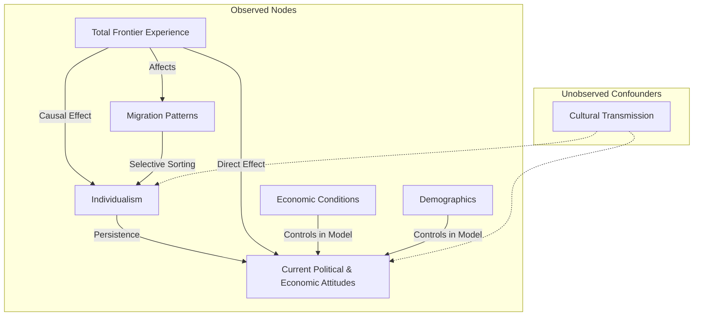

- The paper investigated the “frontier thesis” and identified its long-run implications for culture and politics.

- Total Frontier Experience (TFE) is a measure developed by the authors to quantify the extent to which a county was historically exposed to the frontier between 1790 and 1890.
- The frontier line be defined as the boundary at which population density falls below two people per square mile.
- The individualism be measured through the prevalence of infrequent names, which are more pervasive on the frontier even after accounting for the greater prevalence of immigrants.
  - infrequent names reflect a desire to stand out, as opposed to common names, which reflect a desire to fit in.

# TFE as a Measure to Uncover a Persistent Culture of Rugged Individualism

 - In the mid-20th century, several decades after the closing of the frontier, individualistic children’s names are more pervasive in counties with greater TFE.
 - In the late 20th century and beyond, residents of high-TFE counties prefer less redistribution and lower public spending, and they pay lower property tax rates.
 - High-TFE counties exhibit stronger and, in fact, increasing support for the Republican party between 2000 and 2016.
 - We show that voters in high-TFE counties report greater opposition not only to redistribution but also to social protection, minimum wages, gun control, and environmental protection.

# **How the Paper Rules Out Confounding Effects in Studying Frontier Culture**  

To establish a **causal link** between **Total Frontier Experience (TFE)** and **persistent rugged individualism**, the authors address potential confounding factors using multiple empirical strategies. Below is a structured breakdown of how they **rule out alternative explanations**:  

---

## **1. Controlling for Geographic and Economic Differences**  
**Concern:** Differences in **geography, climate, or early economic structures** (e.g., agriculture, mining) might drive both frontier experience and modern attitudes.  
**Solution:**  
- Include **county-level controls** such as **terrain ruggedness, soil quality, historical industry composition, and population density**.  
- Use **state fixed effects** to control for regional variations in policy and economic development.  

---

## **2. Addressing Selective Migration**  
**Concern:** Individualists might have **self-selected into frontier areas**, rather than frontier life shaping individualism.  
**Solution:**  
- Examine **historical census data** to check whether frontier settlers were systematically different from non-frontier populations.  
- Show that **individualism-related behaviors increased over time in frontier areas**, suggesting cultural adaptation rather than just selective migration.  

---

## **3. Testing Persistence Mechanisms**  
**Concern:** If individualism persists, is it due to **cultural transmission** or **modern economic conditions**?  
**Solution:**  
- Compare TFE effects in **historically frontier-exposed counties that are now urban vs. still rural**.  
- Show that **individualist attitudes persist even in frontier-origin areas that have undergone major economic changes**.  

---

## **4. Placebo Tests with Non-Frontier Areas**  
**Concern:** Other historical events (e.g., slavery, industrialization) could explain the observed patterns.  
**Solution:**  
- Test whether **non-frontier regions with similar demographic and economic histories** exhibit similar persistence effects.  
- Find that **only frontier-exposed areas** display long-term individualist tendencies.  

---

## **5. Instrumental Variable (IV) Strategy**  
**Concern:** Measurement error in TFE or omitted variable bias.  
**Solution:**  
- Use **distance to the historical frontier line** as an **instrumental variable**, ensuring variation in TFE is **exogenous to modern outcomes**.  

---

## **Conclusion: Robust Identification of Causal Effects**  
Through **geographic controls, migration analysis, persistence tests, placebo comparisons, and IV estimation**, the study **effectively isolates the causal impact of frontier experience on modern individualism**. This rigorous approach **rules out alternative explanations** and strengthens the argument that **frontier culture had a lasting influence on American attitudes toward self-reliance and government intervention**.
