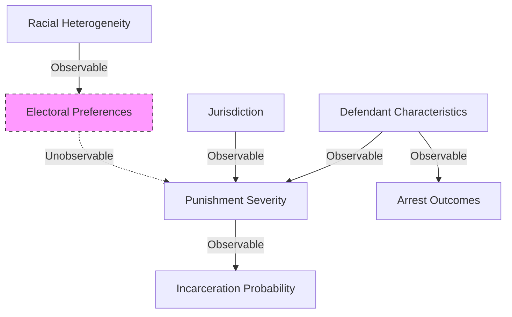

# Data

## **1. Data Sources & Time Coverage**
| **State** | **Data Source** | **Time Period** | **Number of Jurisdictions (Counties)** |
|----------|-----------------|---------------|------------------|
| **Alabama** | Alabama Administrative Office of the Courts | 2000 – 2010 | 67 |
| **North Carolina** | North Carolina Administrative Office of the Courts | 2007 – 2014 | 100 |
| **Texas** | Texas Department of Public Safety | 2000 – 2010 | 253 |
| **Virginia** | Virginia Office of the Executive Secretary | 2006 – 2014 | 118 |

- **Four Southern states covered**: Alabama, North Carolina, Texas, and Virginia.
- **County-level data** covering **538 jurisdictions**.
- **Time span: 2000–2014**, with variations in availability across states.

---

## **2. Sample Size**
| **Category** | **Total Count** |
|-------------|---------------|
| **Total Defendants** | 7,000,000+ |
| **Total Cases** | 13,000,000+ |
| **Total Charges** | 16,000,000+ |
| **Average Charges per Defendant** | 2.3 - 3.1 |

- **Over 7 million defendants and 16 million charges**.
- **Each defendant is charged with an average of 2.3 - 3.1 offenses**.

---

## **3. Defendant Characteristics**
| **Variable** | **Description** |
|-------------|---------------|
| **Gender** | Majority male, ranging from **71.1% to 78.7%** of defendants. |
| **Race** | - Alabama & Virginia: Only **Black and White** included. - North Carolina & Texas: **Black, White, and Hispanic**. - **Race data missing for <1% of cases**. |
| **Age** | Adult defendants, **juvenile cases (under 16) excluded**. |
| **Criminal History** | Indicator for **prior convictions and prior incarceration history**. |

- **Race definitions differ by state**, but the key focus is on **Black vs. White disparities**.
- **Juvenile cases are excluded**, making this an adult defendant dataset.

---

## **4. Jurisdiction Characteristics**
| **Variable** | **Description** |
|-------------|---------------|
| **Black Share** | **Key independent variable**, measuring the proportion of Black residents in a jurisdiction. |
| **Economic Conditions** | Median income, poverty rate, and unemployment rate. |
| **Crime Rate** | Violent and property crime rates at the jurisdiction level. |
| **Political Preferences** | Voter preferences (Republican/Democrat support). |
| **Judicial Resources** | Court budgets, availability of **public defenders**, and judicial staffing. |

- **Black share is the primary explanatory variable**, driving the study’s causal analysis.
- **Crime rate and economic factors included as controls** to isolate racial heterogeneity effects.

---

## **5. Charge Types**
| **Charge Type** | **Description** | **Approximate Share** |
|---------------|----------------|--------------------|
| **Violent Crimes** | Assault, robbery, homicide, etc. | 20-25% |
| **Property Crimes** | Burglary, larceny, fraud. | 30-35% |
| **Drug Offenses** | Drug possession, distribution. | 15-20% |
| **Crimes Against Society** | DUI, weapons possession, disorderly conduct. | 10-15% |
| **Other Offenses** | Misdemeanors, infractions. | <10% |

- **Property and violent crimes account for the largest share** of cases.
- **Drug offenses represent 15-20%**, varying by state.
- **Crimes against society include DUI and firearm-related offenses**.

---

## **6. Measures of Punishment Severity**
| **Measure** | **Definition** | **Purpose** |
|------------|-------------|-----------|
| **Confinement Rate** | Probability of a defendant receiving **incarceration**. | **Primary measure** of punishment severity. |
| **Conviction Rate** | Probability of a defendant being **found guilty**. | Used as an alternative indicator of severity. |
| **Sentence Length** | Length of incarceration for convicted offenders. | Captures the **depth of punishment**. |
| **Plea Bargain Rate** | Proportion of cases resolved via plea agreements. | Reflects prosecutorial strategy differences. |

- **Confinement Rate is the primary measure**, as incarceration represents the harshest form of punishment.
- **Conviction Rate and Sentence Length serve as robustness checks**.
- **Plea bargaining rates vary across jurisdictions**, influencing punishment severity.

---

## **7. Excluded Data (Sample Restrictions)**
| **Exclusion Criteria** | **Reason for Exclusion** |
|------------------------|------------------------|
| **Non-DWI Traffic Offenses** | Minor traffic infractions (e.g., speeding tickets) are not part of the criminal justice system in the same way as other charges. |
| **Juvenile Cases (Defendants under 16)** | The study focuses on adult defendants, and juvenile justice systems follow different legal frameworks. |
| **Technical Probation/Parole Violations** | These violations often result from administrative issues rather than new criminal behavior. |
| **Cases Transferred to Circuit/Superior Courts** | Some cases are handled at a higher court level and may not follow the same sentencing patterns as county-level courts. |
| **Cases with Missing Race Information** | To maintain data consistency, cases where the defendant’s race was not recorded (less than 1%) were excluded. |
| **Dismissed or Withdrawn Cases (in Some Robustness Checks)** | In some alternative specifications, the authors exclude cases where charges were dropped, as they do not result in sentencing outcomes. |

---

## **8. Race Data Restrictions by State**

| **State** | **Race Categories Available** | **Restrictions Applied** | **Reason for Exclusion/Adjustment** |
|----------|----------------------------|------------------------|--------------------------------|
| **Alabama** | Black, White | Cases missing race data are excluded. | Only two race categories recorded in the dataset. |
| **North Carolina** | Black, White, Hispanic | Cases missing race data are excluded. Hispanic defendants are included in robustness checks but not in the main analysis. | Race data is more comprehensive, but the focus is on Black vs. White disparities. |
| **Texas** | Black, White, Hispanic | Hispanic defendants are excluded from main analysis. Cases missing race data are excluded. | To maintain consistency with Alabama & Virginia, Hispanic cases are excluded in the primary specification. |
| **Virginia** | Black, White | Cases missing race data are excluded. | Only Black and White categories are available. |

---
